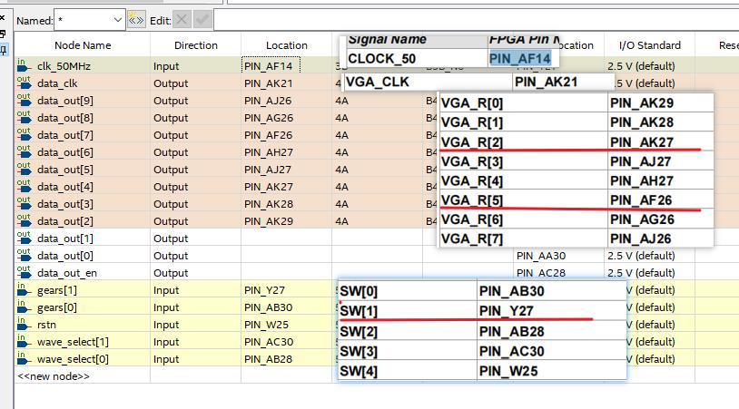

# 函数发生器

## 支持

- 波形：正弦波、 方波、三角波、反三角波
- 频率：1kHz、2kHz、4kHz、10kHz

## 说明

### 顶层模块

```verilog
module FuntionGenerator(
    input clk_50MHz,			   // 输入50MHz时钟
    input rstn,                     // 0-复位(停止输出)  1-正常输出
    input [1:0] wave_select,        // 选择波形 00-三角波 01-反三角波 10-方波 11-余弦波
    input [1:0] gears, 		        // 档位(频率)控制 11 01 00 10 -> 10KHz 4kHz 2kHz 1kHz
    output [9:0] data_out,          // 电平输出(不足10位时取高位信号)
    output reg data_out_en,         // 可能需要用到的D/A开关
    output data_clk                 // 供D/A时钟
);
```

## 可选引脚方案

芯片： Cyclone V 5CSXFC6D6F31C6




